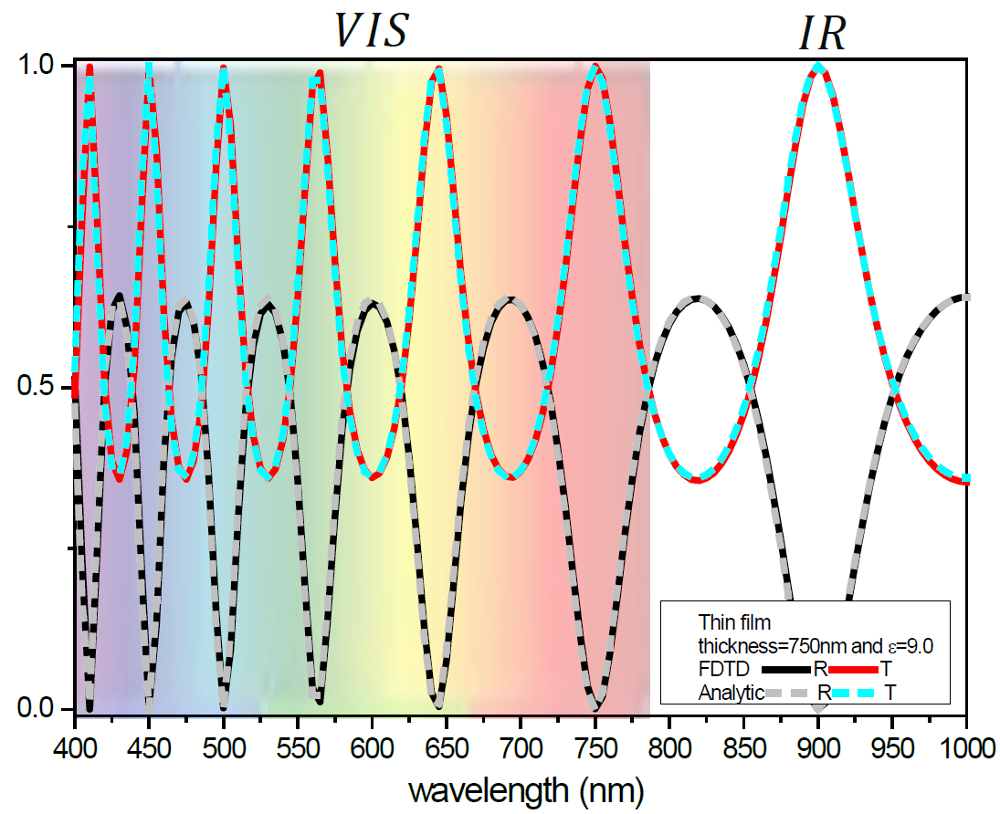

*IrisFDTD-Academic*    
=========

*IrisFDTD-Academic* is a Fortran implementation of the Finite-Difference Time-Domain (FDTD) method.  *IrisFDTD-Academic* is a "toy version" of the IrisFDTD program.

 

*Finite-Difference Time-Domain method* 
---------------------------------------

The FDTD method has been applied in a great variety of engineering and physical problems since originally proposed in 1966 by K. Yee [1]. The FDTD method has been developed over the years, being one of the most spread methods in computational electromagnetism worldwide. In a nutshell, the optical properties of a given system (a living cell, an aircraft, a nanostructure…)  are obtained through calculations of the  electromagnetic field, which is propagated in discretized space and discretized time, according to both Maxwell equations and the constitutive relations (which state how materials respond to the EM field).  FDTD thus provides the whole “movie” of the electromagnetic field evolution of a given system. This information is then post-processed to obtain the EM response of the considered system.

*IrisFDTD* has been developed with the focus on the field of Nanoptics. Nanooptics aims at the understanding of optical phenomena at the nanoscale, beyond the realm of conventional optics and the diffraction limit of light. It is an emerging new field, which opens up new perspectives into the Nanoworld. It is motivated by the rapid growth of nanotechnology and material science. The former supplies the adequate tools and strategies for fabrication, manipulation and characterization of nanosystems, whereas the latter provides the material platforms required for the realization of specific optical effects. Undoubtedly, Nanooptics research is a very promising pathway towards the overcoming of some of the most immediate social challenges, such as the seek for novel technological grounds allowing further development of the knowledge and information   society and the search for clean, efficient energy sources. Therefore, the improvement of the numerical methods and computer technology to be applied in Nanooptics must be a goal by itself. 

*IrisFDTD* has been applied to several problems in Nanoptics [2], to name a few, it has been used to investigate the optical response of nano-structures based on 2d-atomically thin materials like Boron Nitride, with potential applications in optoelectronics in both infrared and THz regimes, and the study of non-linear effects in Nanophotonics, for their potential applications in high-resolution enhanced spectroscopies. The number of physical systems investigated with *IrisFDTD* is quite extense. Most of them gave raise to publications which can be found in the scientific literature (see Ref. [3]). Most of them...that is, there are also many never published that I'll try make available (Mie resonances, Green's functions in FDTD...).

 *References:*
 
[1] A. Taflove, S.C. Hagness, *Computational Electrodynamics: The Finite-Difference Time-Domain Method*, 3rd edn. (Artech House, Boston, 2005).

[2] Sergio G. Rodrigo, [*Optical Properties of Nanostructured Metallic Systems: Studied with the Finite-Difference Time-Domain Method*](https://www.springer.com/gp/book/9783642230844), Springer-Verlag, Berlin, (2012).

[3] https://publons.com/researcher/2827893/sergio-gutierrez-rodrigo/
 

***

*Working with *IrisFDTD-Academic**
----------------------------------------------------


The best way (as always) to learn and use new programs is going through the examples. For instance, the first example provided allows us to calculate the fraction of light transmitted and reflected through a dielectric thin sheet in normal incidence (see example_1 directory). This is a very simple system but that provides strong insight in the physics of waves (interference, difracction, material properties,...). 

The code and the input files (inputFDTD.dat) neccesary for the calculations are provided. The input files try to be self-explanatory. The code is not properly commented and some pieces would seem difficult to understand. A full description of the code files is on its way. 

***

*License*
------------------------------------------------------

*IrisFDTD-Academic* is licensed under the AGPL and it is free to use.  However, if you are using, 
or plan to use it, specially if it is for research or academic purposes, please send an email with your name,
institution and a brief description of your interest for this program. If you use *IrisFDTD-Academic* in a work that leads to a 
scientific or academic publication, we would appreciate it if you would kindly cite *IrisFDTD-Academic* in your manuscript as:

> Sergio G. Rodrigo, [*Optical Properties of Nanostructured Metallic Systems: Studied with the Finite-Difference Time-Domain Method*](https://www.springer.com/gp/book/9783642230844), Springer-Verlag, Berlin, (2012).

Copyright (C) 2005-2020 Sergio G Rodrigo <sergut@unizar.es>

*IrisFDTD-Academic* is free software: you can redistribute it and/or modify it under the terms of the GNU Affero General Public License as published by the Free Software Foundation, either version 3 of the License,or (at your option) any later version.
  
*IrisFDTD-Academic* is distributed in the hope that it will be useful for research or/and academic purpouses, but WITHOUT ANY WARRANTY; without even the implied warranty of MERCHANTABILITY or FITNESS FOR A PARTICULAR PURPOSE. See the GNU Affero General Public License for more details. You should have received a copy of the GNU Affero General Public License along with *IrisFDTD*. If not,see <http://www.gnu.org/licenses/>.

***


```python

```
