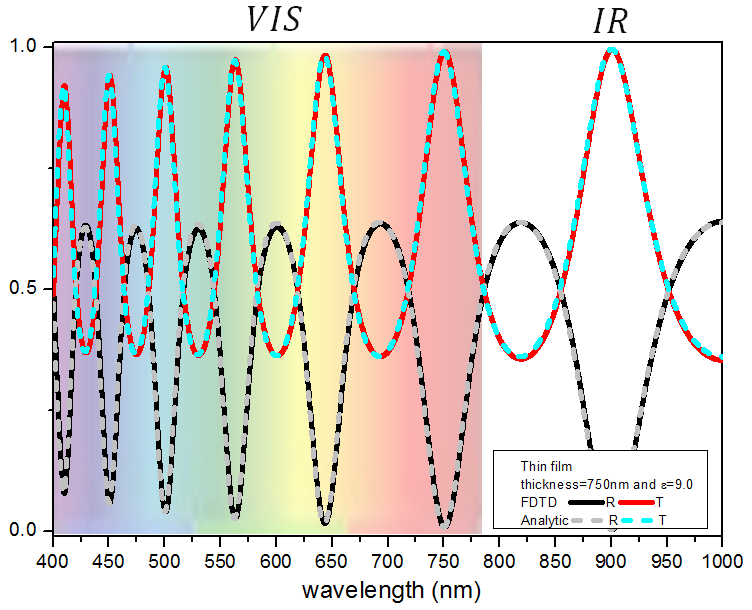

Copyright (C) 2005-2020 Sergio G Rodrigo <sergut@unizar.es>

*IrisFDTD-Academic* is a Fortran implementation of the Finite-Difference Time-Domain (FDTD) method.  *IrisFDTD-Academic* is a "toy version" of the IrisFDTD program.

**Important:** 
*IrisFDTD-Academic* is licensed under the AGPL and it is free to use. if you are using, or plan to use this example, specially if it is for research or academic purposes, please send an email with your name, institution and a brief description of your interest for this program.  If you use this example of *IrisFDTD-Academic* in a work that leads to a scientific or academic publication, we would appreciate it if you would kindly cite in your work:
 
Sergio G. Rodrigo, [*Optical Properties of Nanostructured Metallic Systems: Studied with the Finite-Difference Time-Domain Method*](https://www.springer.com/gp/book/9783642230844), Springer-Verlag, Berlin, (2012).
***
- - -
> **Example 1: transmission and reflection through a dielectric thin sheet**

The first example provided allows you to calculate the fraction of light transmitted and reflected through a dielectric thin sheet in normal incidence. This is a very simple system but that provides strong insight into the physics of waves (interference, difracction, material properties,...). 

The example shows you how to obtain transmission and reflection spectrum through an thin film of a lossless dielectric, on a substrate. The figure shows a comparision between FDTD results and the analytical result, for a dielctric with dielectric constant $\epsilon_2=9.0$ and thickness $h=750$nm. In this case we have a free-standing film.



Take in mind:

+ The code and the input (inputFDTD.dat)  files neccesary for the calculations are provided. The input file tries to be self-explanatory. 

+ The code is not properly commented and some pieces would seem difficult to understand. A full description of the code files is on its way. 

+ The files generated by the program are very simple. You can read inputFDTD.dat for details. You can use irisfdtd_movie.py and irisfdtd_scatt.py (main root) to generate a movie and obtain the transmission and reflection results shown in the figure.
   


```python

```
