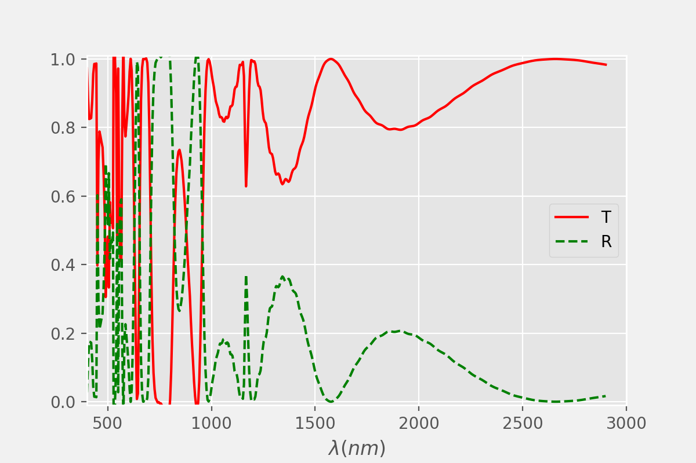
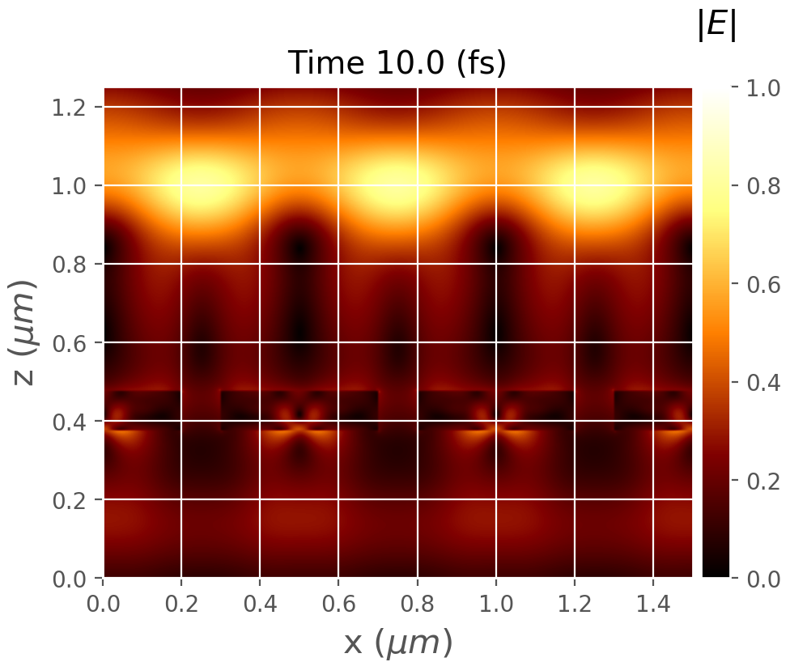

Copyright (C) 2005-2020 Sergio G Rodrigo <sergut@unizar.es>

*IrisFDTD-Academic* is a Fortran implementation of the Finite-Difference Time-Domain (FDTD) method.  *IrisFDTD-Academic* is a "toy version" of the IrisFDTD program.

**Important:** 
*IrisFDTD-Academic* is licensed under the AGPL and it is free to use. if you are using, or plan to use this example, specially if it is for research or academic purposes, please send an email with your name, institution and a brief description of your interest for this program.  If you use this example of *IrisFDTD-Academic* in a work that leads to a scientific or academic publication, we would appreciate it if you would kindly cite in your work:
 
Sergio G. Rodrigo, [*Optical Properties of Nanostructured Metallic Systems: Studied with the Finite-Difference Time-Domain Method*](https://www.springer.com/gp/book/9783642230844), Springer-Verlag, Berlin, (2012).
***
- - -
> **Example 2: transmission and reflection through a slit array made of a lossless dielectric**

The second example allows you to calculate the fraction of light transmitted and reflected through a slit array made od a lossless dielectric, at normal incidence. This is a very simple system but that provides strong insight into the physics of waves (interference, difracction, material properties,...). 

The figure shows the FDTD results for a dielctric with dielectric constant $\epsilon_2=9.0$ and thickness $h=100$nm. The period $p=500$nm and the slits are $100$nm width (free-standing film).


 
  
  
 
 
# *Tips:*

+ The code and the input (inputFDTD.dat)  files neccesary for the calculations are provided. The input file tries to be self-explanatory. A practical exercise is to compare this file with the one of example_1. There is little difference!


+ You can create your own dielectric-based structurs easily by modifying in mesh.f90 (see code/) the subroutine called slit(). In this subroutine the structure is defined with tensor eps_inv, which represents the $1/\epsilon$ between the limits defining the structure $h_i$ and $h_f$ (see inputFDTD.dat for details). Note that eps_inv has been previously initialized in set_emconstans() (mesh.f90), taking a constant value given by eps_bbox, the by default dielectric constant inside structures.  For example, to create a simple multistack is easy!


+ The code is not properly commented and some pieces would seem difficult to understand. A full description of the code files is on its way. 


+ The files generated by the program have very simple structure (see inputFDTD.dat, for details). Use **irisfdtd_scatt.py** (main root) to easily plot transmission and reflection. The python file **irisfdtd_movie.py** generates a movie from a sequence of snapshots of the electromagnetic field (an example of snapshot is shown here).


+ For a spectrum got fully converged, tipically hundreds of fs are needed. To visualize electromagnetic dance, shorter simulations use to be better. In the example provided, the scale is fixed between 0 and 1. You can omit this option modifying irisfdtd_movie.py do not including the kwargs vmin and vmax when calling *createmovie* method.
 


```python

```
